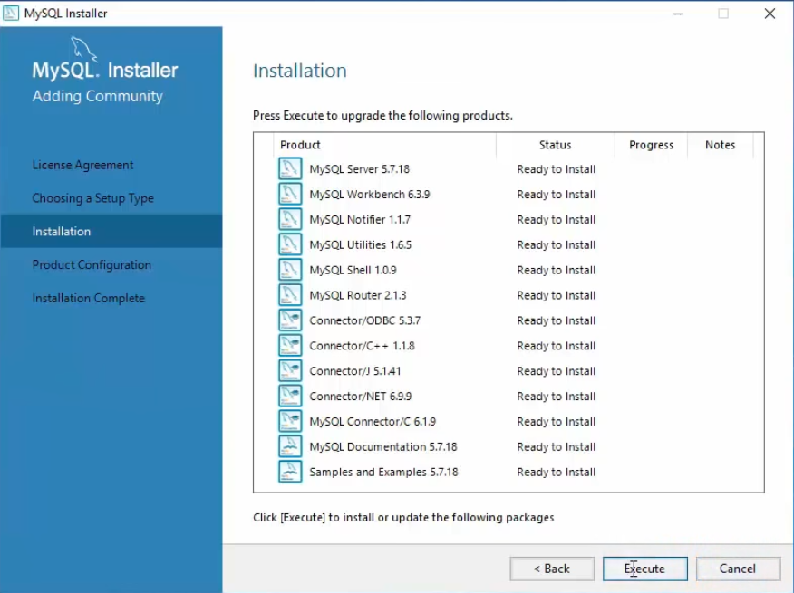
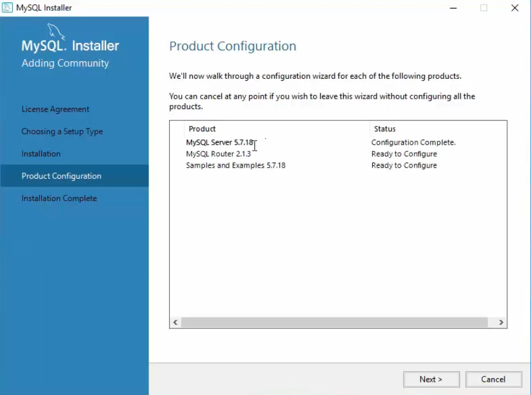
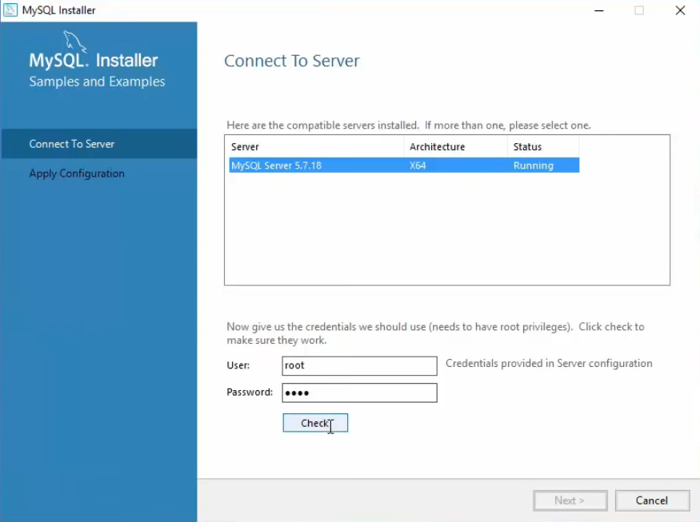
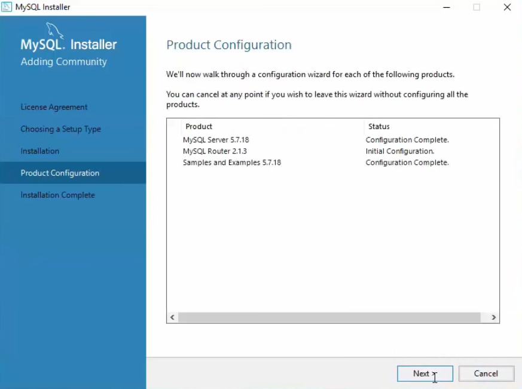

# Library Management System

## Installation Procedure

### Downloading the Application
- Download the _setup_ file which is LMS_setup.exe from the Release Section
- Run the Application and allow **Admin Rights** 
- Choose the required settings 
- Click on _Install_

### Downloading MySQL Database
Install MySQL Community Version from the official website [MySQL installer for Windows](https://dev.mysql.com/downloads/windows/installer/).  

#### Installation
- Download installer from above link and run the installer.
- Accept the license agreement.
- Choose **Developer Default** setup type and click next.
- Click **Execute** to install MySQL products.
- Click **Next** for _Product Configuration_ settings.

    </img>
    </img>

#### Configuration
- In _Type and Networking_, choose **Standalone MySQL Server/Classic MySQL Replication** and click **Next**.
- Leave it as default in _Server Configuration Type_ settings.
- Set a _Root Account Password_.
- Add a user with Database role as _DB Admin_ and click **Next**.
- Leave it as default in _Windows Service_ and _Plugins and Extensions_ settings.
- Now click **Execute** to _Apply Server Configuration_.

    </img>
    </img>
- For _Router Confiugration_, leave it as default and click next.
- For configuring _Samples and Examples_, choose server and check connection with **Check** Button.
- Click **Next** and **Execute** to finish confiugration settings.

    </img>
    </img>
    
- > **_NOTE:_**  Follow [How To Install MySQL on Windows 10 ](https://youtu.be/WuBcTJnIuzo?t=259) for detailed tutorial on installation and configuration.

### Setting up Database

To set up the database and server follow the steps

## Running the Application

- When running the application the first time, you will be required to input your UserName and Password for MySQL Database